# Gen Grave
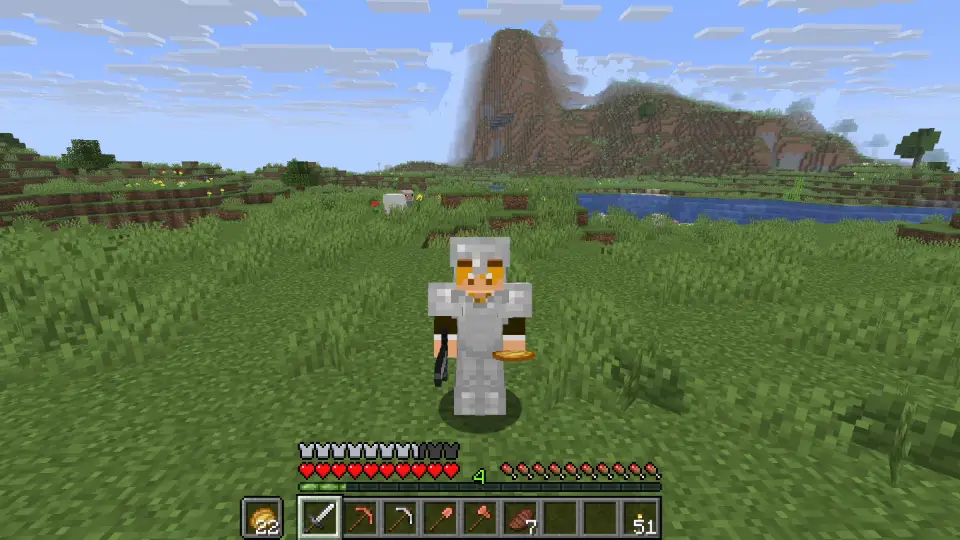  
死亡地点にお墓を生成するデータパックです。

# 特徴
* 経験値の保持が可能
* お墓の破壊時にアイテムを死亡時の配置に戻すことが可能
* お墓に保存された情報をいつでも確認可能
* お墓へのテレポート
* お墓の発光
* お墓の遠隔削除

# ダウンロード
右の[Releases](#)から最新バージョンをダウンロードしてください。  

本データパックは実験的要素を使用しているため、ワールド作成・読み込み時にこのような警告画面が出ますが、気にせず読み込んでください。
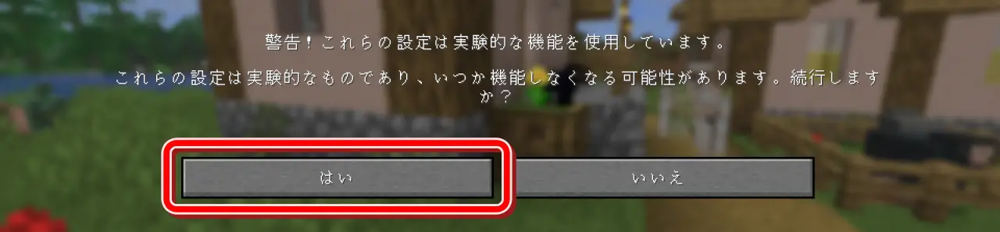  
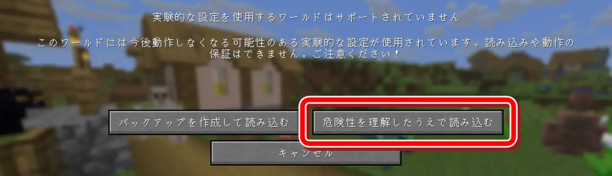  

# 使い方
データパックをワールドに導入した時点で自動的にお墓が生成されるようになります。  
下記の設定をすることでより出来ることが増えます。

# 設定
設定画面はキーボードの「**Gキー**(デフォルト)」を押して開く、クイックアクション画面から開くことができます。  
▼クイックアクション
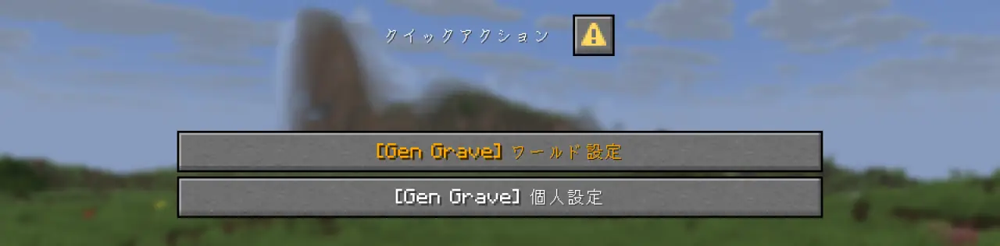  

クイックアクションを開くキーはMinecraftの「キー設定」の「その他」で変更することができます。  
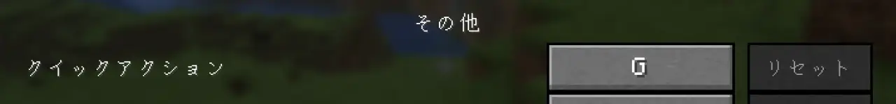

## ワールド設定
ワールド設定は**チートがオン**、もしくは**op権限**を持っているプレイヤーのみ開くことができます。  
開く際に権限の確認をするため、警告画面が出ます。  
  
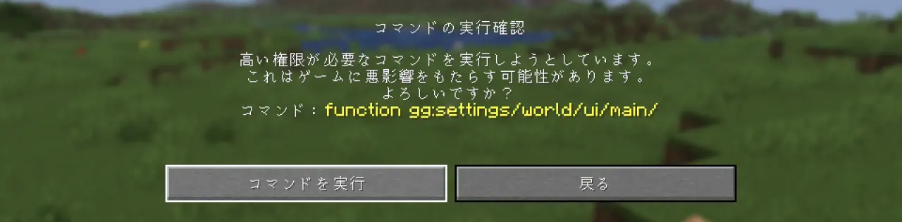  

ワールド設定には項目がいくつかあり、全プレイヤーに適用されます。  
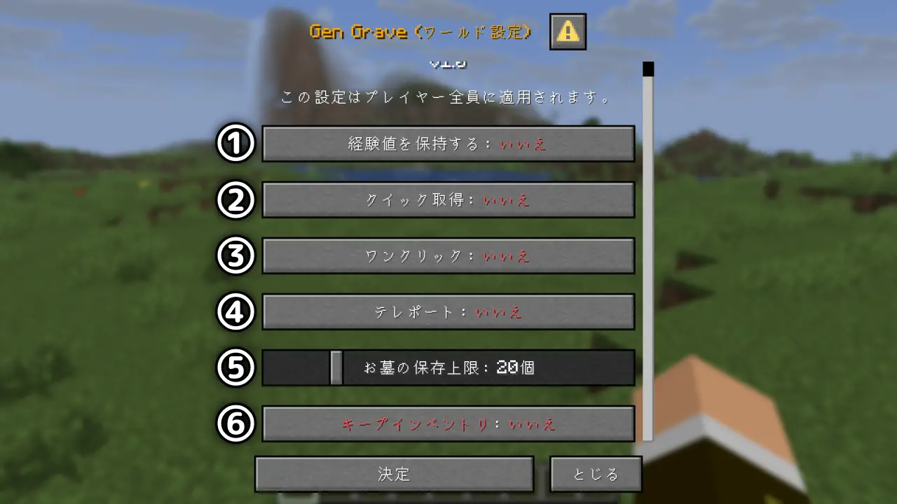  

①経験値を保持する  
お墓を壊した時に、死亡時の経験値をそのまま入手できます。  

②クイック取得  
お墓を壊した時に、アイテムを死亡時のインベントリの配置に戻します。  

③ワンクリック  
お墓をワンクリックで壊すことができるようになります。  

④テレポート  
お墓へのテレポートを許可します。  

⑤お墓の保存上限  
プレイヤー**一人当たり**のお墓の保存上限を設定します。  
この上限を超えると古いお墓から**消去**されていきます。  

⑥キープインベントリ  
バニラのゲームルール「keepInventory」と同じ挙動をするようになります。  
**お墓は生成されなくなります。**  

## 個人設定
個人設定を開くとこのような画面になります。  
  

下の「設定 >」をクリックすることでプレイヤー個人の設定を変更することができます。  
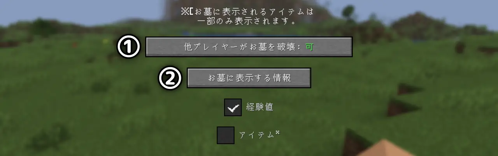  

①他プレイヤーがお墓を破壊  
自分以外のプレイヤーが自分のお墓を壊せるかどうかを設定することができます。  

②お墓に表示する情報  
下の項目にチェックを入れることで、お墓の名前の下に表示する情報を増やすことができます。  
この設定は変更後、新たに生成されるお墓にのみ適用されます。

# お墓
個人設定メニューの「お墓 >」をクリックすることで、自分のお墓の管理ができます。  
  

## お墓一覧
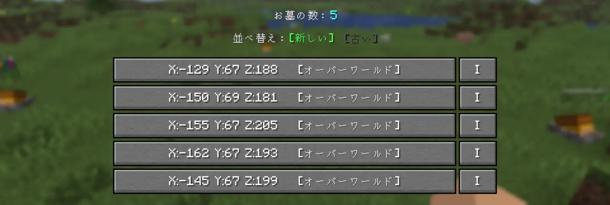  

お墓のリストには上から新しく生成された順にお墓を確認することができます。  
※古い順にすることもできます。  

お墓の座標、ディメンションが書かれている部分をクリックすることで、そのお墓の詳細情報を表示することができます。  
また、横にある「**I**」をクリックすると後述の[インベントリの表示](#インベントリ表示)をすることができます。

## お墓の詳細情報
この画面ではお墓の詳細情報の確認と、操作をすることができます。  
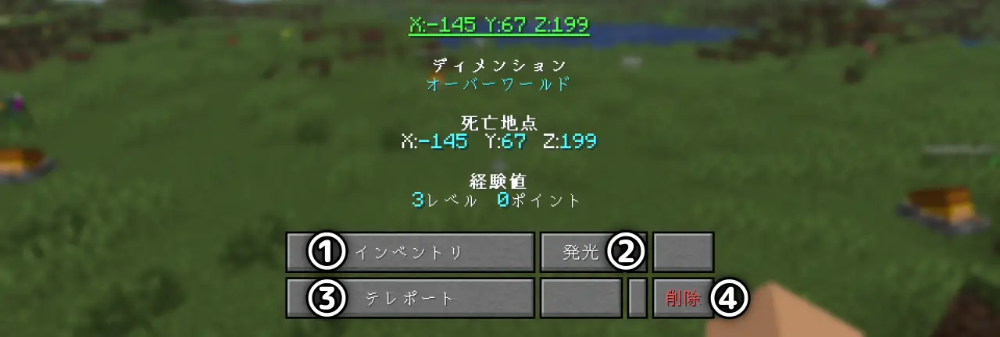  

①インベントリ  
クリックで[インベントリ表示](#インベントリ表示)を行うことができます。  

②発光  
お墓を20秒間発光させることができます。  

③テレポート  
お墓へテレポートします。  
※ワールド設定により許可されている必要があります。  

④削除  
お墓の削除ができます。

## インベントリ表示
お墓のリスト、詳細からインベントリ表示を行うと、スペクテイターモード（**動くことはできません**）になり、ホットバーの上に以下のような表示が出てきます。  
  

▼Eを押すことでお墓に保存されたインベントリの中身を確認することができます。  
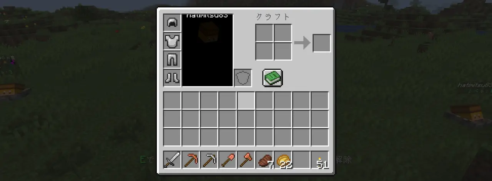  

スニークを押すとこのモードを終了することができます。

# よくある質問
**Q. 入れ方が分かりません。**  
A. saves/ワールド名/datapacks/の中へ**解凍せずに**入れてください。  

**Q. 統合版で使えますか。**  
A. 統合版でデータパックを利用することはできません。  

**Q. Youtubeなどでの動画や配信で利用しても良いですか。**  
A. 良いです。また、クレジット表記や報告は不要です。  

**Q. 改変・再配布をしても良いですか。**  
A. 良いです。しかし、改変・再配布されたもののサポートは行いません。  

**Q. Realmsで使えません。**  
A. 本データパックは試験的な機能を利用しているため、Realmsでは使えません。公式の対応をお待ちください。  

# LICENSE
Gen Grave by はちみつ is marked [CC0 1.0](https://creativecommons.org/publicdomain/zero/1.0/)  
このデータパックに関するいかなる権利も保有しません。  
ご自由にお使いください。
